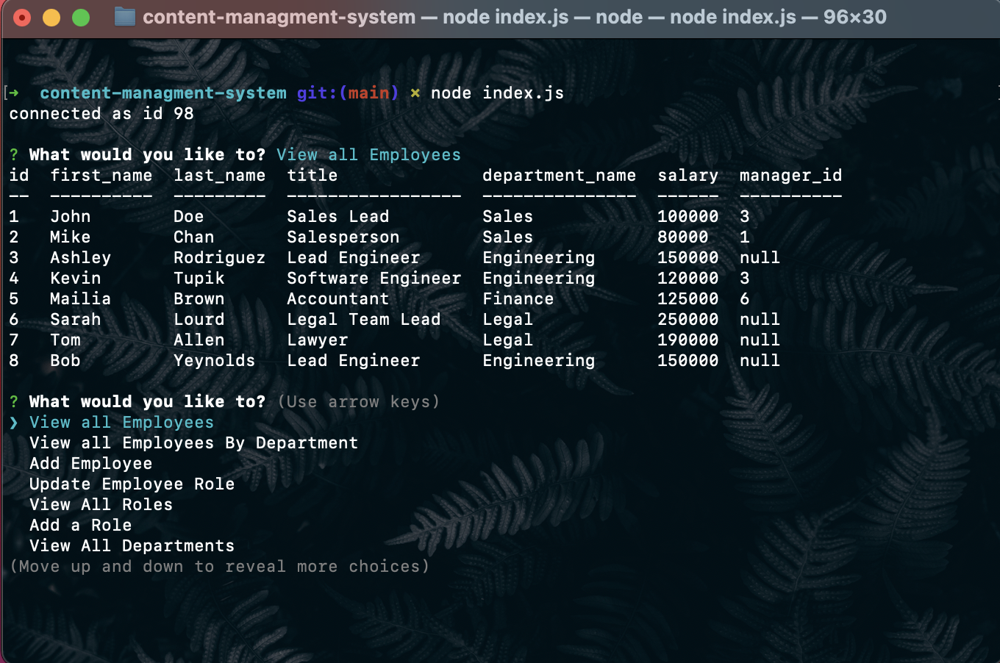

# Content Managment System
  

  <a href="https://opensource.org/licenses/MIT" alt="License">
        </a>
  
  ## Description
  A simple CLI app for managing a company's employees using node, inquirer, and MySQL. 
  This application allows a user to add & view departments, roles, and employees. It can also update employee roles.

  ## Table of Contents
  - [Installation](#installation)
  - [Usage](#usage)
  - [License](#license)
  - [Contributing](#Contributing)
  - [Tests](Test)
  - [Questions](Questions)

  ## Installation
  To install necessary dependencies, run the following command:

``` md
npm i
```

#### Dependencies Include:
- [console.table](https://www.npmjs.com/package/console.table)
- [dotenv](https://www.npmjs.com/package/dotenv)
- [inquirer](https://www.npmjs.com/package/inquirer)
- [mysql](https://www.npmjs.com/package/mysql)

## Usage
Follow this [link](https://drive.google.com/file/d/1C5wPheQhwkCMbgoZbY2UhrvqV6bbV-UF/view?usp=sharing) for a video walk through of the app's functionality 

- starter schema.sql & seeds.sql files have been added to the repo.


## License
This project is licensed under the [MIT](https://opensource.org/licenses/MIT) license.

## Contributing
Please feel free to contact me! See my email and GitHub username below.

## Tests
To run tests, run the following command:

``` md
npm test
```
## Questions
If you have any questions about the repo, open an issue or contact me directly at <sconwell.dev@gmail.com>. You can find more of my work at [shaneconwell](https://github.com/shaneconwell).

